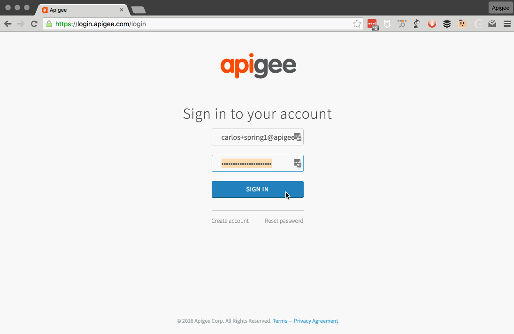
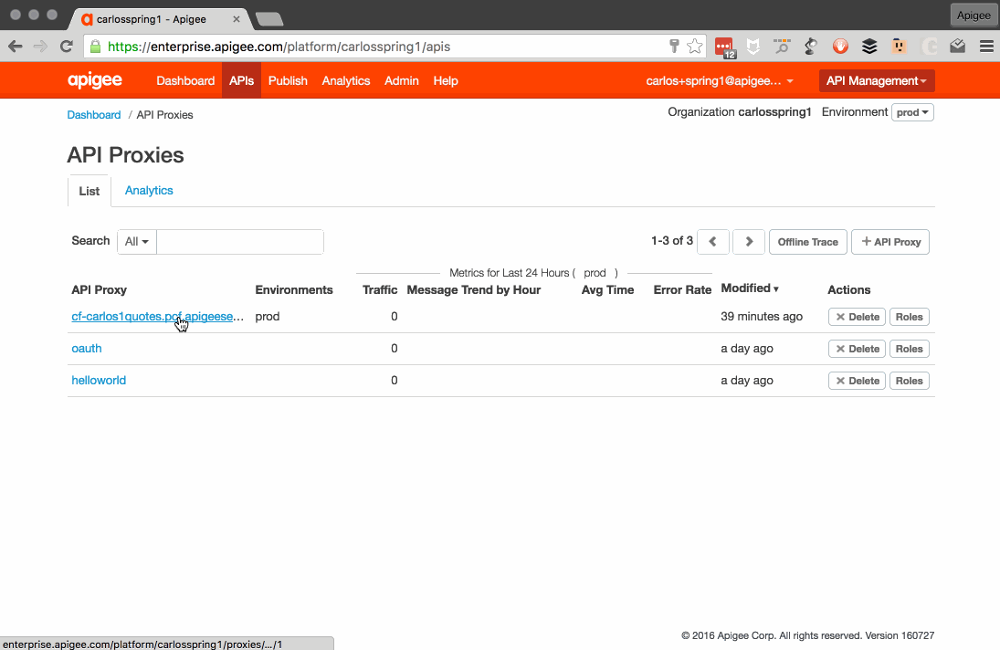

## Route Binding in Cloud Foundry

### What are Route Services?
Cloud Foundry route services are a new type of marketplace service. From the docs:

> Cloud Foundry application developers may wish to apply transformation or processing to requests before they reach an application. Common examples of use cases are authentication, rate limiting, and caching services. Route Services are a new kind of Marketplace Service that developers can use to apply various transformations to application requests by binding an application’s route to a service instance.

But why? Well, Cloud Foundry is great for building cloud native applications. It's easy for you to _use_ services in your applications.. database, logging, configuration, and so forth. But you're left on your own when you want to do something to the requests _before_ they reach your application.

Recall the Cloud Foundry haiku<sup>[1](#footnote1)</sup>
> ”Here is my source code <br/>
&nbsp;&nbsp; &nbsp; &nbsp; Run it on the cloud for me <br/>
&nbsp;&nbsp; &nbsp; &nbsp; &nbsp;&nbsp; &nbsp; &nbsp; I do not care how”

Route Services makes it easy to control how you share those apps and services you've built.. now there's a follow-up haiku<sup>[2](#footnote2)</sup>:

> ”I do care, a bit<br/>
> &nbsp;&nbsp; &nbsp; &nbsp;How other people use it<br/>
> &nbsp;&nbsp; &nbsp; &nbsp;&nbsp;&nbsp; &nbsp; &nbsp;Please make that easy”

### The Apigee Edge Service
At Apigee we've built a service broker for Cloud Foundry that provides Route Services. We've pre-loaded it into the Pivotal Cloud Foundry environment we're using for this session. Use the `cf marketplace` command to view it:
```Shell
➜  quote-service-1.0.0 cf marketplace
Getting services from marketplace in org springone / space carloseberhardt as springone...
OK

service       plans                     description
apigee-edge   org                       Apigee Edge API Platform
p-redis       shared-vm, dedicated-vm   Redis service to provide a key-value store

TIP:  Use 'cf marketplace -s SERVICE' to view descriptions of individual plans of a given service.
➜  quote-service-1.0.0 cf marketplace -s apigee-edge
Getting service plan information for service apigee-edge as springone...
OK

service plan   description                      free or paid
org            Apigee Edge for Route Services   free
➜  quote-service-1.0.0
```

### Creating a Service instance
In this section we will create a service instance we can use with our API. To do this, you'll need a few key pieces of information about your Apigee Edge organization.

The Apigee Service Broker uses the Edge Admin API to verify that you have access to the Edge org and to create the proxy used to handle route services requests. So, when you create an instance of the service you need to provide your Edge credentials and a bit of info about how the service should create proxies.

You pass this info as JSON directly on the command line when creating a service, but it's easier to pass in a file. Let's do that. Create a file with the following information in it:

* Apigee Edge org
* Apigee Edge environment (let's use prod)
* Username
* Password
* Apigee host
* Apigee hostpattern (this is used to build the URL for Route Services)

Here's an example:
```Shell
➜  quote-service-1.0.0 echo '{"org":"carlosspring1","env":"prod","user":"carlos+spring1@apigee.com","pass":"***REMOVED***","host":"apigee.net","hostpattern":"${apigeeOrganization}-${apigeeEnvironment}.${proxyHost}"}' > carlosspring1-config.json
➜  quote-service-1.0.0 cat carlosspring1-config.json
{
  "org": "carlosspring1",
  "env": "prod",
  "user": "carlos+spring1@apigee.com",
  "pass": "***REMOVED***",
  "host": "apigee.net",
  "hostpattern": "${apigeeOrganization}-${apigeeEnvironment}.${proxyHost}"
}
➜  quote-service-1.0.0
```
Make sure your file looks like that. The host and hostpattern entries need to be identical. The others should match your Apigee Edge information.

Now that we have our configuration information stored, we can create a service instance. No time like the present, let's do that now. It's just your familiar `cf create-service` command. Currently the only service plan available is called 'org' and we need to specify that when we create our service instance.
`cf create-service SERVICE PLAN SERVICE_INSTANCE [-c PARAMETERS_AS_JSON] [-t TAGS]`

```Shell
➜  quote-service-1.0.0 cf create-service apigee-edge org carlos-edge -c ./carlosspring1-config.json
Creating service instance carlos-edge in org springone / space carloseberhardt as springone...
OK
➜  quote-service-1.0.0
```
If everything works, the command completes very quickly, and you have a new service available.

```Shell
➜  quote-service-1.0.0 cf services
Getting services in org springone / space carloseberhardt as springone...
OK

name          service       plan   bound apps   last operation
carlos-edge   apigee-edge   org                 create succeeded
➜  quote-service-1.0.0
```

### Binding the API Route to the Service
Now that you have a service instance for the Apigee Edge Route Services, you can bind a route to this service.

There are two new commands available in the cli for working with route services:  `bind-route-service` and `unbind-route-service`. Let's check them out.

```Shell
➜  quote-service-1.0.0 cf bind-route-service
FAILED
Incorrect Usage. Requires DOMAIN and SERVICE_INSTANCE as arguments

NAME:
   bind-route-service - Bind a service instance to an HTTP route

USAGE:
   cf bind-route-service DOMAIN SERVICE_INSTANCE [--hostname HOSTNAME] [--path PATH] [-c PARAMETERS_AS_JSON]

EXAMPLES:
   cf bind-route-service example.com myratelimiter --hostname myapp --path foo
   cf bind-route-service example.com myratelimiter -c file.json
   cf bind-route-service example.com myratelimiter -c '{"valid":"json"}'

   In Windows PowerShell use double-quoted, escaped JSON: "{\"valid\":\"json\"}"
   In Windows Command Line use single-quoted, escaped JSON: '{\"valid\":\"json\"}'

ALIAS:
   brs

OPTIONS:
   -c                  Valid JSON object containing service-specific configuration parameters, provided inline or in a file. For a list of supported configuration parameters, see documentation for the particular service offering.
   --hostname, -n      Hostname used in combination with DOMAIN to specify the route to bind
   --path              Path for the HTTP route
➜  quote-service-1.0.0
```

So, in order to bind our route we need to know a few things.
* DOMAIN
* SERVICE_INSTANCE
* HOSTNAME

The DOMAIN in this session is `pcf.apigeese.net` unless you are using a different PCF environment.

The SERVICE_INSTANCE is the name you gave your service instance. The `cf services` command will show you if you forgot.

The HOSTNAME is name you gave the app when you pushed it. The `cf apps` command will show you if you forgot.

```Shell
➜  quote-service-1.0.0 cf apps
Getting apps in org springone / space carloseberhardt as springone...
OK

name            requested state   instances   memory   disk   urls
carlos1quotes   started           1/1         512M     1G     carlos1quotes.pcf.apigeese.net
➜  quote-service-1.0.0
```
In the above example, you can see the hostname is `carlos1quotes` and the domain is `pcf.apigeese.net` ... together they build the url listed in the command output, `carlos1quotes.pcf.apigeese.net`.

Now that we have the required information, we can bind a route. Let's verify our API is still working as we expect...

```Shell
➜  quote-service-1.0.0 curl -i http://carlos1quotes.pcf.apigeese.net/quotes/APIC
HTTP/1.1 200 OK
Content-Type: application/json;charset=UTF-8
Date: Thu, 28 Jul 2016 16:16:16 GMT
Server: Apache-Coyote/1.1
X-Vcap-Request-Id: 61f66327-0cbe-46d6-4c85-cd8c2a148a72
Content-Length: 240
Connection: keep-alive

{"created":"2016-07-28T16:16:16Z","DaysLow":12.44,"Open":12.38,"PreviousClose":12.38,"Volume":21027,"Price":12.51,"DaysHigh":12.69,"Name":"Apigee Corporation","Symbol":"APIC","Change":0.13,"PercentageChange":"+1.05%","Ask":12.51,"Bid":12.5}%                                                                                                                                                                   ➜  quote-service-1.0.0
```

Looking good. So now bind the route...

```Shell
➜  quote-service-1.0.0 cf bind-route-service pcf.apigeese.net carlos-edge --hostname carlos1quotes
Binding route carlos1quotes.pcf.apigeese.net to service instance carlos-edge in org springone / space carloseberhardt as springone...
OK
➜  quote-service-1.0.0
```

Ok. If you don't get an `OK` verify that the credentials you put into the service configuration file are correct. If everything looks right and it's still not working, let us know.

Make sure the API calls still work after binding the route. Notice we are just using the same curl command as before.. no new URLs or anything...

```Shell
➜  quote-service-1.0.0 curl -i http://carlos1quotes.pcf.apigeese.net/quotes/APIC
HTTP/1.1 200 OK
Content-Type: application/json;charset=UTF-8
Date: Thu, 28 Jul 2016 16:20:07 GMT
Server: Apache-Coyote/1.1
X-Vcap-Request-Id: 9c292070-413a-43f5-7095-126a212b9825
X-Vcap-Request-Id: 543650c2-bcd7-463f-61f2-7fb1508bafe9
Content-Length: 240
Connection: keep-alive

{"created":"2016-07-28T16:20:07Z","DaysLow":12.44,"Open":12.38,"PreviousClose":12.38,"Volume":21027,"Price":12.51,"DaysHigh":12.69,"Name":"Apigee Corporation","Symbol":"APIC","Change":0.13,"PercentageChange":"+1.05%","Ask":12.51,"Bid":12.5}%                                                                                                                                                                   ➜  quote-service-1.0.0
```

Again, looking good. Astute folks will notice there are a couple of new headers.. this is good. These are headers the Cloud Foundry router adds in order to do its route services tricks.

So what just happened? Well, when you asked Cloud Foundry to bind the route, it in turn asked the Apigee Service broker to respond with a URL the router should use to direct traffic to prior to serving the request to your API. The Apigee service broker communicated with the Apigee management API to automatically create a proxy and returned the URL of that proxy to Cloud Foundry. It's just APIs. ¯\\_(ツ)_/¯

### The Apigee Edge Proxy
Let's log into Apigee Edge and take a look at the proxy that we created. Get your browser over to https://edge.apigee.com. Log in if you need to, and navigate to the APIs page:



You should see an API proxy named like "cf-<your route name>" .. if you don't, verify that you have the correct org selected in the Edge UI. In the next lab we'll dive into the proxy more, but let's take a quick look at the trace capability here so we can verify the traffic is flowing. Click on the API Proxy, select the Trace tab on the window that pops up, and click the Start Trace Session button:



Now make a couple of API calls again using curl or your browser. Then view your Apigee Edge window again. You'll see the requests you've made appear in the trace session. This shows that we are automatically redirecting the API calls through our Apigee Edge proxy. Huzzah!


## Recap
In this lab you learned (or patiently re-learned) about Cloud Foundry Route services. You created a service instance for the Apigee Edge Service and you bound your API route to that service. Finally, you verified that the traffic was routing through Edge as expected. Next up, some traffic management!

<a name="footnote1">1</a>: https://twitter.com/sramji/status/599255828772716544
<a name="footnote2">2</a>:https://twitter.com/carloseberhardt/status/732956885209485312
